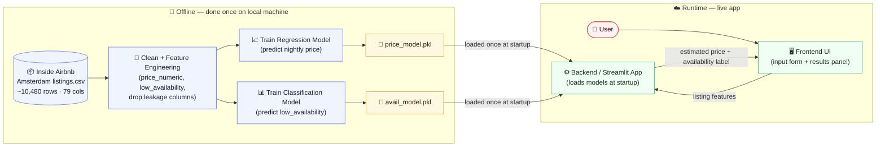

## Architecture — Airbnb Stay Value Predictor (Amsterdam)

### Mermaid Source



---

### Written Explanation

Both models are trained offline, once, on my local machine using the downloaded Inside Airbnb Amsterdam listings CSV. During training, the raw data is cleaned and engineered into features — including deriving `price_numeric` and the `low_availability` binary label — and two separate models are fitted: one regression model for nightly price and one classification model for availability. Each fitted pipeline is saved to disk as a `.pkl` file (`price_model.pkl` and `avail_model.pkl`). The Streamlit app loads both model files once at startup, so no training happens at runtime. When a user fills in listing details in the frontend form and submits, the backend calls `.predict()` on the pre-loaded models and returns the estimated price and the availability prediction to the frontend — inference is fast because the models are already in memory.
```
